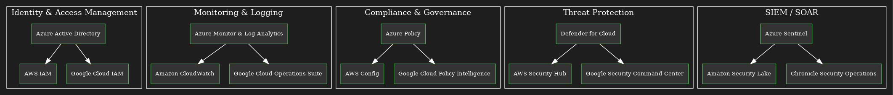

# Assignment 2 – Cloud Service Alternatives Report

**Author:** *Yuntian Du*

> This report maps the Azure security/compliance services used in the course to their closest equivalents on AWS and GCP, then compares them across **features, security & compliance, pricing, and DevSecOps integration**.

------

## 0) At‑a‑Glance Mapping

| Azure (Used in Course)                                       | Closest AWS Equivalent(s)                                    | Closest GCP Equivalent(s)                                    |
| ------------------------------------------------------------ | ------------------------------------------------------------ | ------------------------------------------------------------ |
| **Microsoft Entra ID** (formerly Azure AD): SSO, IAM, Conditional Access | **AWS IAM** (roles, policies), **IAM Identity Center** (SSO), **Amazon Cognito** (end‑user auth) | **Cloud IAM** + **Cloud Identity** (org directory/SSO), **Identity Platform** (end‑user auth) |
| **Azure Monitor & Log Analytics**                            | **Amazon CloudWatch** (metrics/logs/traces) + **AWS X‑Ray**  | **Cloud Monitoring** + **Cloud Logging** + **Cloud Trace/Profiler** |
| **Azure Policy**                                             | **AWS Organizations Service Control Policies (SCPs)** + **AWS Config Rules/Conformance Packs** | **Organization Policy Service** (constraints) + **Policy Controller (OPA/Gatekeeper)** for GKE |
| **Defender for Cloud** (CSPM + CWPP)                         | **AWS Security Hub** (findings aggregation) + **GuardDuty** (threat detection) + **Inspector** (vuln) + **Detective** (investigation) | **Security Command Center (SCC)** Standard/Premium + **Container/Artifact Scanning** + **Cloud IDS** |
| **Microsoft Sentinel** (SIEM/SOAR)                           | **Security Lake** + **Amazon OpenSearch (Security Analytics)** + partner SIEM (e.g., Splunk) | **Chronicle Security Operations** (SIEM + SOAR)              |

------

## 1) Microsoft Entra ID (Azure AD) ↔ AWS IAM/Identity Center/Cognito ↔ GCP IAM/Cloud Identity/Identity Platform

### Comparison Table

| Aspect                    | **Entra ID (Azure AD)**                                      | **AWS IAM / Identity Center / Cognito**                      | **GCP Cloud IAM / Cloud Identity / Identity Platform**       |
| ------------------------- | ------------------------------------------------------------ | ------------------------------------------------------------ | ------------------------------------------------------------ |
| **Overview**              | Cloud directory & identity platform for workforce and external users; SSO, MFA, Conditional Access, app registrations, service principals, managed identities. | IAM manages permissions to AWS resources; Identity Center provides SSO to accounts/apps; Cognito offers end‑user auth (B2C/B2B). | Cloud IAM controls access to GCP resources; Cloud Identity provides org directory/SSO; Identity Platform provides end‑user auth (B2C/B2B). |
| **Core Features**         | SSO (SAML/OIDC), Conditional Access, MFA/Passwordless, PIM (just‑in‑time admin), B2B/B2C, SCIM, Workload identities/service principals, Managed Identity. | IAM policies/roles, STS, role assumption, Identity Center SSO, SAML/OIDC app integrations, Cognito User Pools & federation, device posture via integrations. | IAM roles/policies, Workforce identity federation, Cloud Identity SSO, Context‑aware access, Identity‑Aware Proxy (IAP), Identity Platform (OIDC/SAML), Workforce/Workload Identity Federation. |
| **Security & Compliance** | Broad certifications (e.g., ISO/SOC/PCI/HIPAA/FedRAMP) and conditional access/risk‑based policies; identity protection; audit logs (Sign‑in/Directory). | Broad certifications across AWS; IAM with CloudTrail auditing; MFA; Organizations SCPs; Cognito with secure token services. | Broad certifications across GCP; IAM audit logs; BeyondCorp/IAP model; Cloud Identity enterprise features. |
| **Pricing Model**         | Free, **P1**, **P2** tiers; B2C MAU‑based.                   | IAM no direct charge; Identity Center typically no extra charge; **Cognito** billed per MAU and features. | Cloud IAM no direct charge; **Cloud Identity** Free/Premium (per user); **Identity Platform** MAU‑based. |
| **DevSecOps Integration** | OIDC federation for CI/CD (GitHub Actions) → federated credentials; Managed Identity for Azure workloads; Conditional Access for admin access; SCIM for user provisioning. | OIDC federation from CI/CD to IAM roles (GitHub OIDC); cross‑account roles; Cognito hosted UI/SDKs; SCP guardrails. | Workload/Workforce Identity Federation for CI/CD; IAP in front of Cloud Run/GCE; Identity Platform SDKs; org‑level policies for admin access. |

### Narrative Analysis

- **Design pattern:** Workforce identity (admins, engineers) + end‑user identity (apps). Azure often uses **Entra ID** for both; AWS/GCP split workforce IAM from customer identity products.
- **Conditional access/risk‑based controls** are strong in Entra ID; GCP emphasizes **context‑aware access** and **IAP**; AWS leans on IAM, **Organizations/SCPs**, and **Identity Center**.
- **For pipelines**, prefer **OIDC federation** over long‑lived keys across all clouds.

**Strengths / Weaknesses**

- **Azure:** 
  - **Strengths**: Rich conditional access, PIM; 
  - **Weaknesses**: Licensing complexity (P1 vs P2 vs B2C).
- **AWS:** 
  - **Strengths**: Fine‑grained IAM & role assumption; 
  - **Weaknesses**: End‑user identity needs **Cognito** (separate service).
- **GCP:** 
  - **Strengths**: BeyondCorp/IAP model; 
  - **Weaknesses**: Split between Cloud Identity vs Identity Platform can confuse new teams.

------

## 2) Azure Monitor & Log Analytics ↔ CloudWatch/X‑Ray ↔ Cloud Monitoring/Logging/Trace

### Comparison Table

| Aspect                    | **Azure Monitor & Log Analytics**                            | **AWS CloudWatch (+ X‑Ray)**                                 | **GCP Cloud Monitoring/Logging (+ Trace/Profiler)**          |
| ------------------------- | ------------------------------------------------------------ | ------------------------------------------------------------ | ------------------------------------------------------------ |
| **Overview**              | Unified telemetry platform: metrics, logs, traces; Log Analytics workspace with **KQL**; diagnostic settings for PaaS/IaaS. | Metrics, logs, events, dashboards; structured log search via **Logs Insights**; **X‑Ray** for traces. | Managed metrics/logs/traces; query via **Monitoring Query Language**; integrations with Cloud Ops suite. |
| **Core Features**         | Data Collection Rules, agent/agentless ingestion, resource/Activity logs, Application Insights, workbooks, alerts, Action Groups. | Metrics/alarms, log groups/queries, dashboards, alarms, **Metric Filters**, Contributor alarms; X‑Ray tracing. | Metrics scopes, Uptime checks, SLOs/error budgets, Logging sinks/BigQuery export, Alerts/Policies, Trace/Profiler. |
| **Security & Compliance** | RBAC/privileged access for workspaces; immutable retention options; private links; common certifications. | IAM/RBAC for CloudWatch, KMS encryption, log integrity validation; common certifications. | IAM, CMEK support, org policy control; common certifications. |
| **Pricing Model**         | **Per‑GB ingestion**, retention/day, solutions (e.g., Application Insights) and alert executions. | **Per‑GB ingestion** for Logs/metrics; per‑alarm and API costs; X‑Ray sampling/storage. | **Per‑GB ingestion** and retention; alert policy charges minimal; BigQuery export billed separately. |
| **DevSecOps Integration** | CI/CD emits deployment events to logs; KQL powers anomaly detection; dashboards/workbooks for SLOs; native hooks to **Sentinel**. | CloudWatch alarms drive **SNS/Lambda** runbooks; Logs Insights in incident playbooks. | Logging sinks to **Pub/Sub/BigQuery**; alerting hooks to **Cloud Functions/Run**; SRE SLO tooling. |

### Narrative Analysis

- **KQL** is a major Azure differentiator for rapid threat/ops queries. AWS/GCP offer capable but different syntaxes (Logs Insights / Monitoring QL).
- **OpenTelemetry** is supported across clouds; use it to standardize tracing and log attributes.
- For **cost control**, route verbose app logs to cold storage (e.g., Storage/S3/GCS) and keep high‑value signals in the hot workspace.

**Strengths / Weaknesses**

- **Azure:** 
  - **Strengths**: KQL power; rich PaaS diagnostic connectors. 
  - **Weaknesses**: Ingestion costs can spike without sampling.
- **AWS:** 
  - **Strengths**: Tight with eventing (SNS/EventBridge). 
  - **Weaknesses**: Multiple consoles (Logs, Metrics, X‑Ray) can feel fragmented.
- **GCP:** 
  - **Strengths**: Strong BigQuery integration for analytics. 
  - **Weaknesses**: Query language differences vs KQL require relearning.

------

## 3) Azure Policy ↔ AWS SCPs/Config ↔ GCP Organization Policy

### Comparison Table

| Aspect                    | **Azure Policy**                                             | **AWS SCPs + AWS Config Rules/Conformance Packs**            | **GCP Organization Policy (+ Policy Controller)**            |
| ------------------------- | ------------------------------------------------------------ | ------------------------------------------------------------ | ------------------------------------------------------------ |
| **Overview**              | Policy as code to **deny/audit/remediate** non‑compliant resources; assignments at mgmt group/subscription/resource group. | SCPs enforce guardrails at org/account level; **AWS Config** evaluates resource compliance; Conformance Packs group rules. | Org Policy enforces constraints (e.g., locations, external IPs, CMEK); **Policy Controller** (OPA/Gatekeeper) validates K8s configs. |
| **Core Features**         | Effects: `Deny`, `Audit`, `Append`, `DeployIfNotExists`, `Modify`; initiatives; parameters; remediation tasks. | SCP conditions (e.g., regions), Config managed/custom rules, auto‑remediation via SSM/Lambda; conformance packs. | Predefined constraints, custom org policies; policy inheritance; fleet‑wide K8s policy via Gatekeeper; violations surfaced in Cloud Console. |
| **Security & Compliance** | Enforce data residency, tagging, network posture; compliance dashboard via Policy Insights. | Guardrails for PCI/HIPAA baselines using Conformance Packs; audit via CloudTrail/Config. | Org Policies for location/egress/CMEK; SCC integrates violations; audit logs. |
| **Pricing Model**         | Policy evaluation generally **no direct charge**; remediation may use runtime services (Functions/Automation). | **Config** billed per rule/resource evaluations; SCPs no direct charge. | Org Policy **no direct charge**; Policy Controller billed with GKE; remediation actions may incur costs. |
| **DevSecOps Integration** | Treat policies as code (Bicep/ARM/Terraform); **policy gates** in CI/CD; exemptions workflow; export to Git. | Policy‑as‑code via CloudFormation/Terraform; pre‑deploy hooks; pipeline checks with **cfn‑guard/Conftest**. | Policy‑as‑code via Terraform/CLI; **OPA/Conftest** in CI; validate before `gcloud`/Terraform applies. |

### Narrative Analysis

- Use **preventive controls** (deny at creation) before detective controls to minimize blast radius.
- Centralize policies as code with change control and **exceptions (exemptions)** workflow.

**Strengths / Weaknesses**

- **Azure:** 
  - **Strengths**: Rich effects (`DeployIfNotExists`); initiatives scale well. 
  - **Weaknesses**: Authoring JSON with aliases has a learning curve.
- **AWS:** 
  - **Strengths**: SCPs provide hard guardrails; Config rules cover deep resource posture. 
  - **Weaknesses**: Config pricing can add up at scale.
- **GCP:** 
  - **Strengths**: Simple constraints for common needs; strong K8s policy via Gatekeeper. 
  - **Weaknesses**: Fewer turnkey constraints vs Azure’s effects.

------

## 4) Defender for Cloud (CSPM + CWPP) ↔ AWS Security Hub/GuardDuty/Inspector/Detective ↔ GCP Security Command Center

### Comparison Table

| Aspect                    | **Defender for Cloud**                                       | **AWS Security Hub + GuardDuty + Inspector + Detective**     | **GCP Security Command Center (SCC) + Cloud IDS + Artifact/Container Scanning** |
| ------------------------- | ------------------------------------------------------------ | ------------------------------------------------------------ | ------------------------------------------------------------ |
| **Overview**              | Cloud security posture management (CSPM) + workload protection (servers, containers, databases); attack path analysis; regulatory compliance. | Aggregation of findings (**Security Hub**), threat detection (**GuardDuty**), vuln assessment (**Inspector**), investigation aid (**Detective**). | SCC Standard/Premium for posture/threats; integrate **Container/Artifact scanning**, **Cloud IDS**, threat intel, detection & response. |
| **Core Features**         | Secure Score, recommendations, regulatory compliance views; agent/agentless VM/container protection; data/SQL protections; DevOps integration (repos, IaC). | Findings normalization (ASFF), continuous threat intel, ECR/ECS/EC2 scanning, anomaly detection (VPC Flow, CloudTrail, DNS). | Posture and threat findings across org; container image scanning; DLP integration; IDS (Suricata‑based); integration with SIEM (Chronicle). |
| **Security & Compliance** | Mappings to standards in compliance dashboard; integration with Policy/Sentinel; RBAC scoping. | Security Hub controls map to standards (CIS, PCI); GuardDuty/Inspector managed detections; IAM scoping. | SCC policies aligned to standards; org‑wide visibility; IAM scoping; CMEK options. |
| **Pricing Model**         | **Per resource/feature plan** (servers, containers, databases, DevOps, etc.). | **Per service pricing** (GuardDuty by event volume, Inspector by instance/vCPU time, Security Hub per check, Detective per GB). | **SCC Premium** subscription; scanning/IDS billed per resource/traffic; Chronicle billed by data volume/tier. |
| **DevSecOps Integration** | PR annotations for IaC misconfigs; CI scanning; export to Sentinel/Log Analytics; workflow automations. | EventBridge routes findings → Lambda/Step Functions; Inspector integrates with pipelines; Security Hub as central bus. | SCC findings → Pub/Sub/Chronicle; Cloud Build/Artifact Registry scanning; Functions/Run for workflows. |

### Narrative Analysis

- Azure offers a **single console** for CSPM+CWPP; AWS splits concerns across services but consolidates via **Security Hub**; GCP uses **SCC** as the central pane.
- Prioritize **automated remediation** via runbooks (Logic Apps/Lambda/Cloud Functions) for high‑confidence findings.

**Strengths / Weaknesses**

- **Azure:** 
  - **Strengths**: Unified experience; deep Defender plans. 
  - **Weaknesses**: Feature licensing matrix to manage.
- **AWS:** 
  - **Strengths**: Highly modular; best‑of‑breed detections. 
  - **Weaknesses**: Pricing/coverage scattered across services.
- **GCP:** 
  - **Strengths**: SCC Premium breadth; strong container/security analytics ties. 
  - **Weaknesses**: Some advanced detections gated to higher tiers.

------

## 5) Microsoft Sentinel (SIEM/SOAR) ↔ AWS Security Lake + OpenSearch (or partner SIEM) ↔ Google Chronicle Security Operations

### Comparison Table

| Aspect                    | **Microsoft Sentinel**                                       | **AWS (Security Lake + OpenSearch SIEM + Partners)**         | **Google Chronicle Security Operations**                     |
| ------------------------- | ------------------------------------------------------------ | ------------------------------------------------------------ | ------------------------------------------------------------ |
| **Overview**              | Cloud‑native **SIEM/SOAR** on Azure; ingest via connectors, analytics rules with **KQL**, automation via **Logic Apps** playbooks. | **Security Lake** centralizes logs to S3 (Open Cybersecurity Schema Framework); analytics via **OpenSearch** or partner SIEM (Splunk, QRadar). | Managed **SIEM + SOAR** (Chronicle + SOAR), long‑term telemetry, detections, investigations, and automated response. |
| **Core Features**         | Data connectors (O365, AAD/Entra, Defender, AWS/GCP), analytic rules, UEBA, notebooks, hunting queries, incidents, SOAR playbooks. | Central lake ingest (multi‑account), OCSF schema, Athena/Lake Formation governance, OpenSearch dashboards/alerts, partner integrations. | High‑scale ingestion, detections, investigation UI, playbooks (SOAR), threat intel, native Google signals. |
| **Security & Compliance** | RBAC/Log Analytics workspace controls; multi‑region; mappings to regulations via content packs. | S3/KMS/IAM governance; regional controls; compliance depends on components used. | IAM/CMEK/Regional controls; enterprise compliance across Google Cloud. |
| **Pricing Model**         | **Per‑GB ingestion** (pay‑as‑you‑go) or **Commitment tiers**; archive/search costs. | **Storage (S3)** + **query/compute (Athena/OpenSearch)** + ingestion services; partner SIEM billed separately. | Chronicle subscription/ingestion‑based; SOAR actions may have additional costs. |
| **DevSecOps Integration** | Rules‑as‑code in Git; CI to validate/deploy analytics & playbooks; automation via Logic Apps; Jupyter notebooks for threat hunting. | IaC for lake infra; detections as code in OpenSearch/partner SIEM; response via Lambda/Step Functions. | Detections/playbooks as code; response via Cloud Functions/Run; exporter sinks for pipelines. |

### Narrative Analysis

- **Sentinel** is an opinionated, full **SIEM/SOAR**. AWS provides primitives (**Security Lake**, **OpenSearch**) and relies on partner SIEMs for parity. GCP’s **Chronicle** is the closest like‑for‑like managed SIEM.
- Standardize on a schema (e.g., **OCSF**/**ASIM**) to ease multi‑cloud correlation.

**Strengths / Weaknesses**

- **Azure:** 
  - **Strengths**: First‑party connectors and KQL; built‑in SOAR. 
  - **Weaknesses**: Ingestion costs require governance (commitment tiers/archiving).
- **AWS:** 
  - **Strengths**: Flexible lake architecture; choose best‑fit SIEM. 
  - **Weaknesses**: DIY assembly increases complexity/time‑to‑value.
- **GCP:** 
  - **Strengths**: Managed SIEM/SOAR at scale. 
  - **Weaknesses**: Licensing/tier clarity needed early.

------

## 6) Cross‑Cutting DevSecOps Practices (All Clouds)

- **Identity for CI/CD**: Prefer **OIDC federation** from GitHub/GitLab to temporary cloud credentials (avoid long‑lived keys).
- **IaC & Policy‑as‑Code**: Use Terraform/Bicep/ARM (Azure), CloudFormation/CDK (AWS), Terraform/CLI (GCP). Integrate **policy checks** (Azure Policy, SCPs + Config, Org Policies) in PR gates with **Conftest/OPA/cfn‑guard**.
- **Secrets Management**: Azure Key Vault ↔ AWS Secrets Manager/KMS ↔ GCP Secret Manager/KMS; rotate and scope to workloads.
- **Observability**: Adopt **OpenTelemetry** for traces/logs/metrics; centralize logs selectively to control cost.
- **Threat Modeling & Runbooks**: Define playbooks for common incidents (credential stuffing, brute force, anomalous admin activity) and codify remediation (Logic Apps / Lambda / Cloud Functions).
- **Data Residency**: Enforce allowed regions via Azure Policy / SCPs / Org Policy; audit exceptions.

------

## 7) Pricing Considerations (High‑Level)

- **Identity**: Entra ID (Free/P1/P2; B2C MAU), Cognito (MAU), Cloud Identity (per‑user), Identity Platform (MAU).
- **Observability**: All three clouds largely bill **per‑GB ingestion/retention**; traces and advanced analytics add compute costs.
- **Policy**: Azure Policy/Org Policy/SCPs usually no direct charge; **AWS Config** charges per rule/resource evaluation.
- **CSPM/CWPP**: Defender plans per resource; AWS split pricing (GuardDuty, Inspector, Security Hub, Detective); GCP SCC Premium subscription + per‑feature costs.
- **SIEM/SOAR**: Sentinel per‑GB or commitment; AWS components (S3/Athena/OpenSearch) + partner SIEM; Chronicle subscription/ingest.

------

## 8) Putting It Together – Example Control Stack

- **Preventive**: Azure Policy (deny non‑Canada regions, require tags, block public IPs) ↔ AWS SCP/Config ↔ GCP Org Policy.
- **Detective**: KQL in Log Analytics for brute‑force and protected‑route abuse ↔ CloudWatch Logs Insights ↔ Cloud Logging queries.
- **Responsive**: Azure Monitor Alerts + Action Groups ↔ CloudWatch Alarms + SNS/Lambda ↔ Cloud Monitoring Alerts + Pub/Sub/Functions.
- **SIEM**: Microsoft Sentinel ↔ Security Lake + OpenSearch/partner SIEM ↔ Chronicle.

These mirror my prior course labs/assignments (Auth0 login, brute‑force detection, protected‑route abuse detection, Azure Policy governance).

------

## Appendix A – References and Additional Notes

[Appendix-A](./appendix/AppendixA.md)

------

## Appendix B – Terminology

- **CSPM**: Cloud Security Posture Management.
- **CWPP**: Cloud Workload Protection Platform.
- **SIEM/SOAR**: Security Information and Event Management / Security Orchestration, Automation and Response.
- **KQL**: Kusto Query Language.
- **OCSF**: Open Cybersecurity Schema Framework.
- **IAP**: Identity‑Aware Proxy.